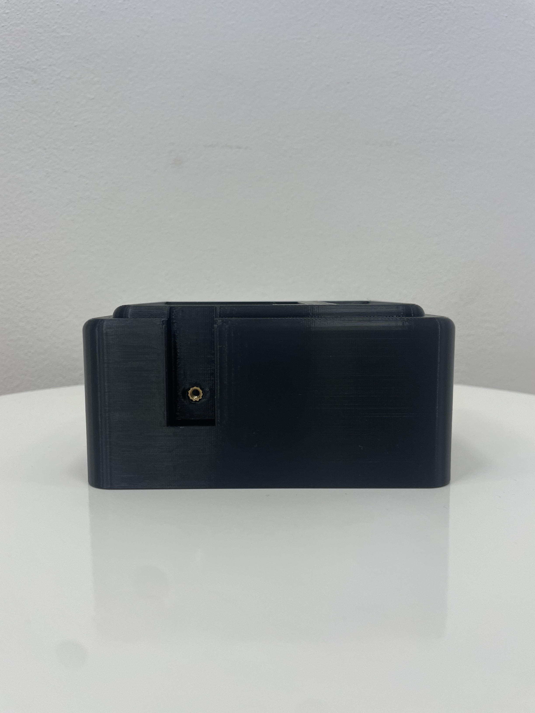
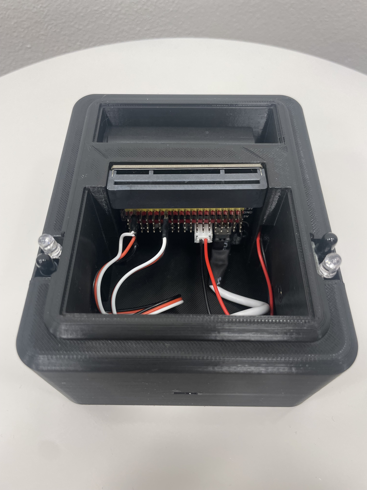
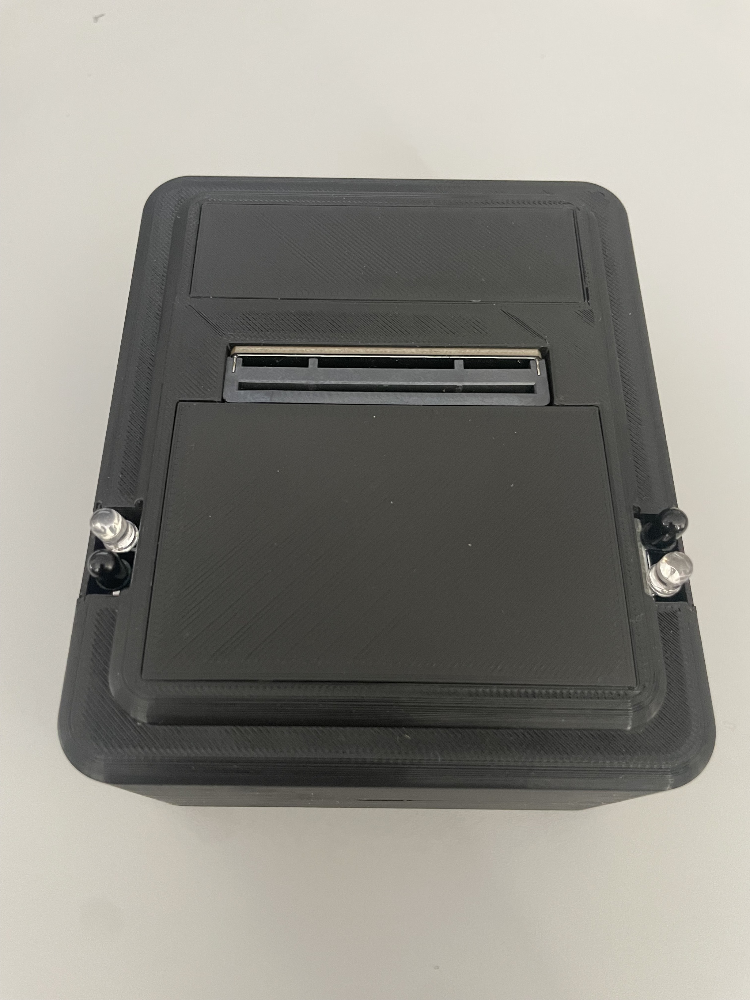

 # MicroBit "Reaction game" cover for MBT0008

   

## Reaction game
### How does this game work?
A game for two players. The game engine displays an "icon" on the LEDs after a randomly long time (3-10 s) after the game restarts, and at the same time (without delay) starts a tone of 1.5 s. This indicates the start of the game. The player's task is to press the "button" before the opponent. The "button" can be pressed immediately after the LEDs are lit, while the tone is still sounding.
### Results
- Player 1 was faster → then the display shows "1"
- Faster was player 2 → then display shows "2"
- They both pressed the "button" at the same moment (within the computer's reaction time) → then the display shows "R" → Draw
- Player 1 pressed the "button" one or more times before the game started → then the display shows "B"	
- Player 2 has pressed the "button" one or more times before the game starts → then the display shows "A"
- Both players have pressed the "button" one or more times before the game starts → then the display shows "C" → Cheater
  
  [Code here](https://github.com/pslib-cz/2022-p2a-mme-pppp-Lukypop/blob/main/pxt-reaction-game-as-txt.txt)
  
## Tips & Tricks

- [Installing heat nuts](https://markforged.com/resources/blog/heat-set-inserts)
- [Cable crimping](https://ratrig.dozuki.com/Guide/11.+Cable+Crimping/80)
- [Soldering](https://www.makerspaces.com/how-to-solder/)

## What do you need?

- Microbit extension [MBT0008](https://www.dfrobot.com/product-1867.html)
- 2 pieces of [Insert Nut M3](https://www.aliexpress.com/item/1005004701945081.html)
- 2 pieces of [IR sensor](https://www.aliexpress.com/item/1297063929.html)
- 1 piece of [Batery Holder AA](https://www.aliexpress.com/item/1005002927831106.html)
- 1 piece of [Vertical micro USB ](https://www.aliexpress.com/item/1005002650191316.html)
- 1 piece of [Micro USB connector](https://www.aliexpress.com/item/32267930530.html)
- ~150 grams of filament ABS
- 1× 2-way cable
- 2× 3-way crimped cables
- 2× LEGO part 2780 [example](https://www.amazon.co.uk/Technic-Friction-Ridges-Lengthwise-Center/dp/B01N6WURXK/)

## Embedding parts
### Step 1:
- download and print [parts](https://github.com/pslib-cz/2022-p2a-mme-pppp-Lukypop/tree/main/parts) or [parts as STL](https://github.com/pslib-cz/2022-p2a-mme-pppp-Lukypop/tree/main/parts/STL) using a 3d printer
### Step 2:
- insert heat nuts on both sides
  
   

### Step 3:
- insert lego parts into the holes
- place Microbit MBT0008 on these parts
  
   
   

### Step 4:
- Connect IR sensor to 3-way crimped cable and put it through hole
- Screw the M3 bolt to hold IR sensor into heat insert nut

   
   
 
- Slide sensor lids into thin holes
- Do it on both sides

   
  
- Connect 3-way crimped cables to MBT0008 on pins: 1, 2 (see image)

   
   

### Step 5:
- put battery holder cable through hole
- connect it into MBT0008 (into [JST-PH plug](./images/JST_plug.jpg))
- place battery holder in storage place

   
   
### Step 6:
- Connect 2-way cable with vertical micro USB plug and micro USB connector using soldering
- Be careful about + and - (see image if you are not sure)

   

- Connect micro USB into MBT0008 and glue vertical micro USB plug into pre-made hole

     
     
- Close both storage places with lids

     
     
### Step 7:
- upload the code to the micro:bit [code here](https://github.com/pslib-cz/2022-p2a-mme-pppp-Lukypop/blob/main/microbit-pxt-reaction-game.hex) or [as .txt here](https://github.com/pslib-cz/2022-p2a-mme-pppp-Lukypop/blob/main/pxt-reaction-game-as-txt.txt)
- you can use [Micro:bit MakeCode](https://makecode.microbit.org/) to download it into micro:bit easily

