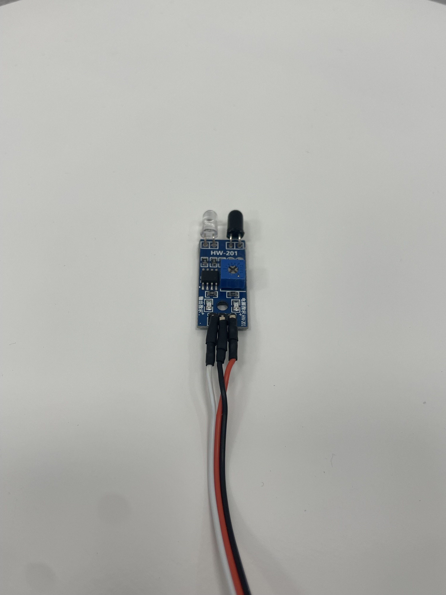
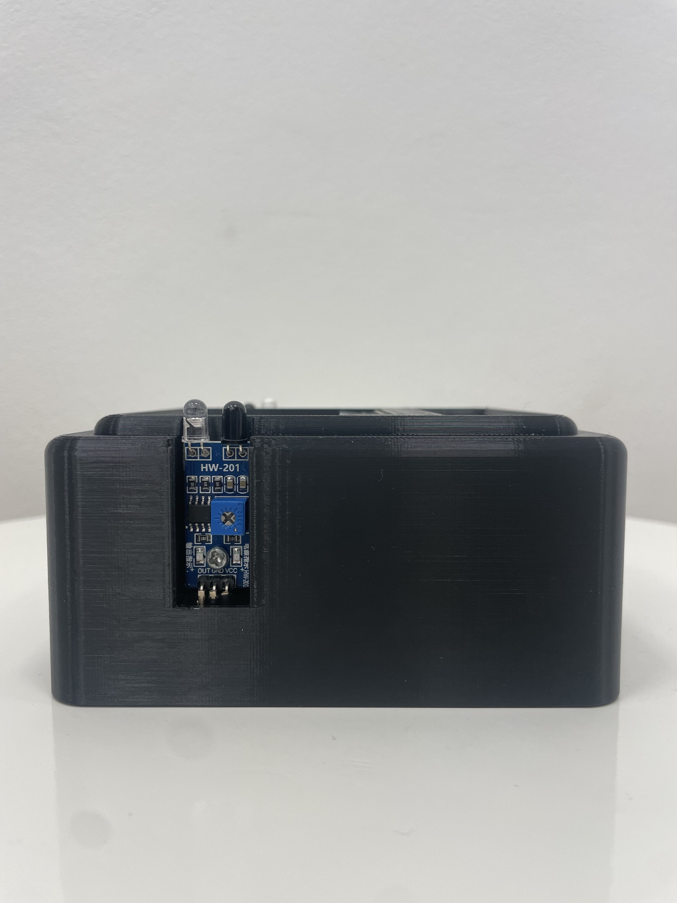
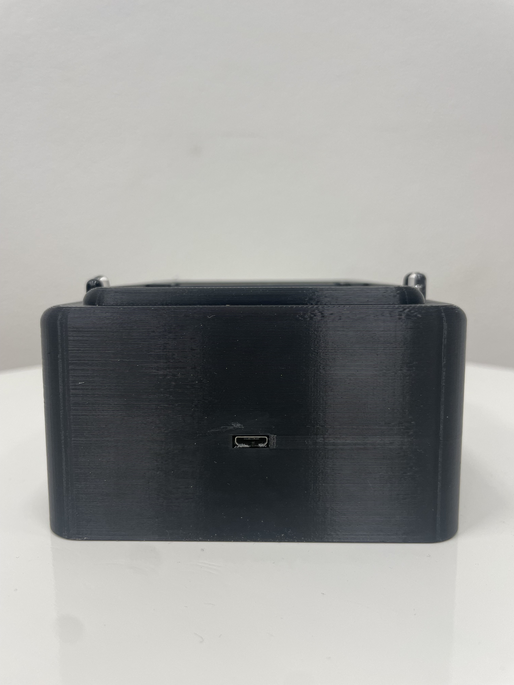

 # Pouzdro na "Postřehovou hru" pro Micro:bit V2 IO Expansion Board

   

## Postřehová hra
### Jak tato hra funguje?
Hra pro dva hráče. Herní engine po náhodně dlouhé době (3–10 s) od restartu hry zobrazí "ikonu" na ledkách a zároveň (bez prodlevy) spustí tón o délce 1,5 s. Tak je indikováno zahájení hry. Úkolem hráče je stisknout "tlačítko" dříve než soupeř. "Tlačítko" lze stisknout ihned po rozsvícení led diod, ještě v době, kdy zvuk tónu zní.
Pokud je hra zahájena, herní engine po stisku "tlačítka" zobrazí výsledek hry. Existuje 6 možných výsledků:
### Výsledky
- Rychlejší byl hráč 1 → potom display zobrazí "1"	
- Rychlejší byl hráč 2 → potom display zobrazí "2"
- Oba stiskli "tlačítko" ve stejném okamžiku (v rámci reakční doby počítače) → potom display zobrazí "R"emíza
- Hráč 1 stiskl "tlačítko" jednou nebo vícekrát ještě před zahájením hry → potom display zobrazí "B"
- Hráč 2 stiskl "tlačítko" jednou nebo vícekrát ještě před zahájením hry → potom display zobrazí "A"
- Oba hráči stiskli "tlačítko" jednou nebo vícekrát ještě před zahájením hry → potom display zobrazí "C"heater
  [kód zde](https://github.com/pslib-cz/2022-p2a-mme-pppp-Lukypop/blob/main/pxt-reaction-game-as-txt.txt)
  
## Tipy a Triky
- [Vložení tepelné matice](https://markforged.com/resources/blog/heat-set-inserts)
- [Krimpování kabelů](https://ratrig.dozuki.com/Guide/11.+Cable+Crimping/80)
- [Pájení](https://www.makerspaces.com/how-to-solder/)

## Co budeme potřebovat?
- Micro:bit rozšíření [Micro:bit V2 IO Expansion Board](https://www.aliexpress.com/item/1005002353248507.html)
- 2 kusy [Insert matice M3](https://www.aliexpress.com/item/1005004701945081.html)
- 2 kusy [IR senzor](https://www.aliexpress.com/item/1297063929.html)
- 1 kusy [Pouzdro na baterie AA](https://www.aliexpress.com/item/1005002927831106.html)
- 1 kus [Vertikální micro USB ](https://www.aliexpress.com/item/1005002650191316.html)
- 1 kus [Micro USB konektor](https://www.aliexpress.com/item/32267930530.html)
- ~150 gramů filamentu ABS
- 1× 2-žilný kabel (9 cm)
- 2× 3-žilné krimpované kabely (10 cm)
- 2× LEGO součástka 2780 [příklad](https://www.amazon.co.uk/Technic-Friction-Ridges-Lengthwise-Center/dp/B01N6WURXK/)

## Spojení součástek do sebe
### Krok 1:
- stáhněte a vytiskněte [součásky](https://github.com/pslib-cz/2022-p2a-mme-pppp-Lukypop/tree/main/parts) nebo [součástky jako STL](https://github.com/pslib-cz/2022-p2a-mme-pppp-Lukypop/tree/main/parts/STL) pomocí 3D tiskárny
### Krok 2:
- vložte z obou stran insertové matice
  
   

### Krok 3:
- Vložte lego spojky do děr v hlavním dílu
- Umístěte Micro:bit V2 IO Expansion Board na tyto spojky
  
   
   

### Krok 4:
- Propojte IR senzor pomocí krimpovaného 3-žilného kabelu a protáhněte jej dírou v hlavním dílu
- Přišroubujte IR senzor pomocí šroubu M3 do insertové matice

   
   
 
- Zasuňte krytku na senzor do drážky
- Udělejte "Krok 4" na obou stranách 

   
  
- Připojte krimpovaný 3-žilný kabel do Micro:bit V2 IO Expansion Board na piny: 1, 2 (viz obrázek)

   
   

### Krok 5:
- Protáhněte kabel od pouzdra na baterie dírou v hlavním díle
- Zapojte jej do Micro:bit V2 IO Expansion Board (do [JST-PH plug](./images/JST_plug.jpg))
- Vložte pouzdro na baterie do zadní části, ve které je na to připravemé místo 

   
   
### Krok 6:
- Propojte dvoužilný kabel s vertikálním plugem micro USB a konektorem micro USB pomocí pájení
- Buďte opatrní na + a - ([viz obrázek](https://github.com/pslib-cz/2022-p2a-mme-pppp-Lukypop/blob/main/images/micro_usb_wiring.png) pokud si nejste jist)

   

- Připojte micro USB do Micro:bit V2 IO Expansion Board a přilepte vertikální micro USB plug do před-dělané díry

     
     
- Zavřete všechny prostory pomocí víček

     
     
### Krok 7:
- Nahrajte kód do micro:bitu [kód zde](https://github.com/pslib-cz/2022-p2a-mme-pppp-Lukypop/blob/main/microbit-pxt-reaction-game.hex) nebo [jako .txt zde](https://github.com/pslib-cz/2022-p2a-mme-pppp-Lukypop/blob/main/pxt-reaction-game-as-txt.txt)
- Můžete použít [Micro:bit MakeCode](https://makecode.microbit.org/) na snadné stažení kódu do micro:bitu

## Autor
[@Lukypop](https://github.com/Lukypop)

